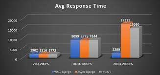

<p align="center">
  <a href="" rel="noopener">
 </a>
</p>

<h3 align="center">FastAPI framework를 활용한 API 공부</h3>

<div align="center">


</div>

---

<p align="center"> FastAPI Python framework를 활용한 API의 설계, 구현, 보안 및 배포 등등을 공부
    <br> 
</p>


## 📝 Table of Contents

- [About](#about)
- [Prerequisites](#prerequisites)
- [Getting Started](#getting_started)
- [what I learned](#what_I_learned)
- [TODO] (#todo)
## 🧐 About <a name = "about"></a>


FastAPI는 python을 활용한 마이크로 웹 프레임워크로 asyncio 와 type hint를 활용한 최신 프레임 워크이다.

### Prerequisites <a name = "prerequisites"></a>

- Python Ver 3.9.13
- Postgresql
- postman
- Docker Engine
- Heroku
- AWS EC2

## 🏁 Getting Started <a name = "getting_started"></a>

Python Ver -> 3.9.13
1. virtual env를 생성한 후 
  ```pip install -r requirements.txt```

2. 라이브러리 설치 후 postgresql 설치

> :warning: **.env 파일은 push 하지 않았기 때문에 직접 작성해야 함.**
3. Database와 library 설치가 끝나면 아래 명령어로 실행  
  ```uvicorn app.main:app --reload```

4. 잘 동작하는지는 Postman으로 테스트


### ⛏️ what I learned <a name = "what_I_learned"></a>

- FastAPI
- Pydantic
- CROS
- JWT
- OAuth2
- Alembic
- Heroku & AWS 
- NGINX
- Gunicorn
- Docker & Docer-compose


## 🔧 TODO <a name = "todo"></a>

- Testing
- CI/CD Pipeline (gitub action)

